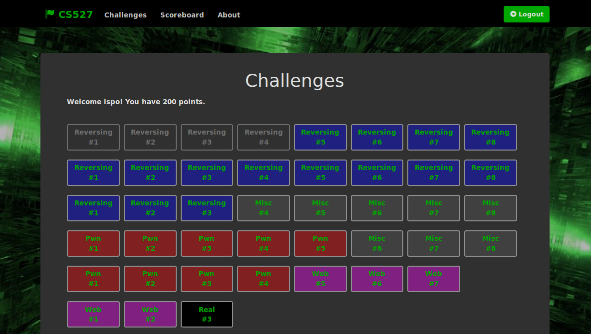
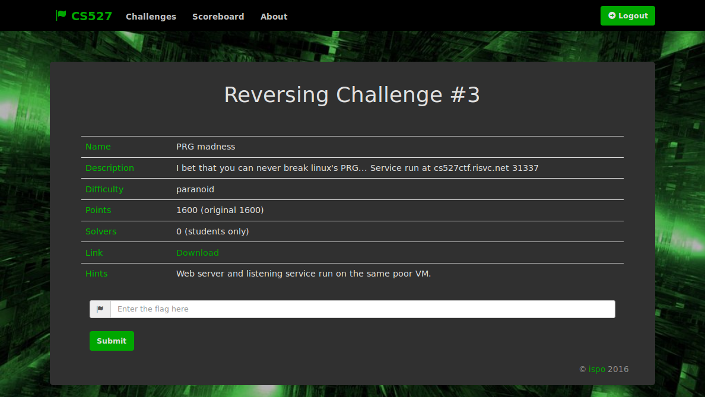
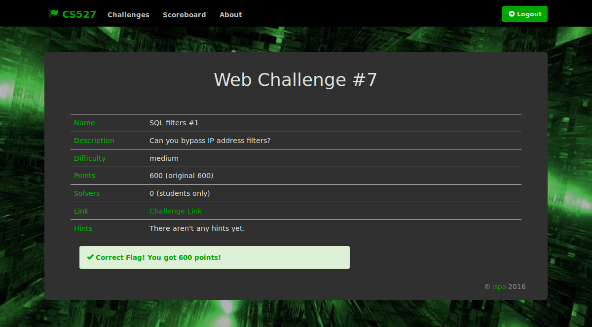
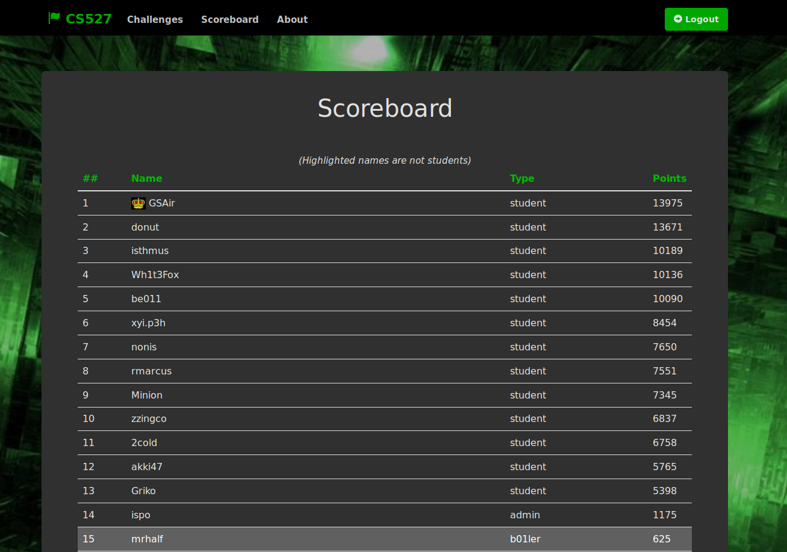

## CTF Website for Software Security Class
#### Spring 2016

This is a simple CTF Website that I created for Software Security class that I was a TA.

In the sql_src file you can find the SQL code that is used to create and manage the DB.

In the admin_scripts you can find some scripts that make admin's life easier.

### Screendumps

